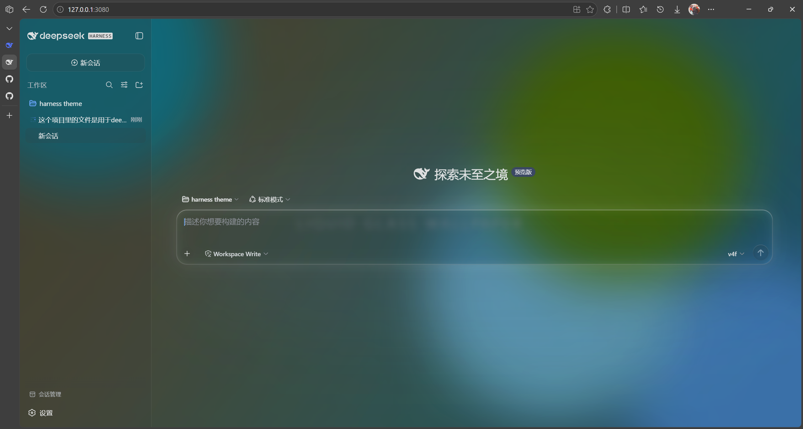
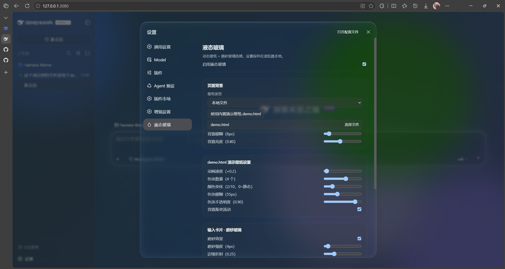

# dsh-theme-liquid-glass

Apple Liquid Glass 主题插件 for DeepSeek Harness。

- **液态玻璃 UI**：通过 `ctx.theme.overrideTokens` 把 `--dsw-alias-*` 语义 token 覆盖为半透明玻璃质感（`{light, dark}` 两套值），
  玻璃参数由 body 上的 `--dsh-lg-*` CSS 变量驱动，改动即时生效。
- **高亮提示**：所有可以点击的元素都有悬浮高亮提示.
- **动态壁纸**：支持网页链接（iframe / 可选 host 代理）、本地 HTML（`<DSH_HOME>/wallpapers` 目录）、本地图片、本地视频。
- **可自定义玻璃**：磨砂开关、磨砂强度（px）、边缘折射强度、玻璃颜色、玻璃亮度。
- **边缘折射（v0.3.0）**：输入框、发送按钮、消息气泡、视图标签、队列坞、侧边栏按钮应用 SVG feDisplacementMap 边缘折射效果，模拟液态玻璃的"边缘膨胀"变形。强度可通过设置滑块调节。
- **侧边栏设置（v0.3.0）**：侧边栏独立玻璃（透明度/颜色/模糊/亮度/边缘高光），可单独关闭侧边栏定制。
- **毛玻璃实现**：`filter: blur()` 直接打在背景图层上（`inset: -48px` 留出模糊出血），**不用** `backdrop-filter`
  （backdrop-filter 会让 #root 成为所有 fixed 定位后代的包含块，菜单/弹层/toast 会被重新锚定到 #root）。
- **设置页**：设置 →「液态玻璃」（与通用设置 / 模型 / 插件 并列的独立顶层页，`settings.section` 槽位），
  分「页面背景」「输入卡片 · 磨砂玻璃」两组，实时生效；「恢复默认」一键还原。
- **完全关闭**：「启用液态玻璃」开关会同时撤掉 token 层、壁纸与**全部**毛玻璃/透镜边缘规则
  （效果规则全部挂在 `body.dsh-lg-on` 门控 class 上，关闭即整体失效，不残留高光）。
- **本地文件选择**：壁纸类型选本地 HTML / 图片 / 视频 / 本地文件时，点击输入框直接拉起系统文件选择器；
  选中后经 `POST /liquid-glass/upload` 上传到壁纸目录（文件名 `lg-<时间戳>-<原文件名>`），再通过
  `/liquid-glass/wallpaper/<文件名>` 生效。

## 结构

```
src/index.ts          host 半区：壁纸文件路由 + 文件上传 + 网页代理
src/client/index.ts   browser 半区：token 层 + 背景图层 + 玻璃参数 + 设置页
src/shared.ts         常量与设置类型（无运行时依赖）
build.mjs             swc 构建（lib/index.js + lib/client.js 加载器格式）
```

## 构建

```bash
npm install
npm run build        # 一次性构建
npm run watch        # watch 模式（配合 client-hmr 热替换）
npm run dev          # 构建 + 冒烟测试
```

## 安装到 web profile

### 方式一：从 npm 安装（推荐，稳定版）

```bash
dsh plugin --profile web add dsh-theme-liquid-glass
```

刷新浏览器即可生效。

### 方式二：本地开发链接

```bash
dsh plugin --profile web add "D:\deepseek harness workspace\harness theme\dsh-theme-liquid-glass"
```

刷新浏览器即可生效。

> **改代码后的重装**：本地开发时，每次改代码后需重新构建并重装到 profile：
> ```bash
> cd "D:\deepseek harness workspace\harness theme\dsh-theme-liquid-glass"
> node build.mjs
> dsh plugin --profile web add "D:\deepseek harness workspace\harness theme\dsh-theme-liquid-glass"
> ```
> 开发期也可用 `node build.mjs --watch` 监听源码自动重建。
> **client 改动**（设置页 UI、玻璃参数）构建后刷新即可生效；
> **host 改动**（路由/上传端点）需要重启 `dsh web` 才会重新加载 host 半区。

## 客户端注入说明

client 半区必须在 bundle 里导出 `inject`（**服务名**数组：
`['slots','locale','theme']`，与已发布的 dsh-ui-appearance / dsh-dream-skin 一致）。
client loader 用它构建 fiber 注入表，缺失会导致 `cannot get property X without inject` 并让
整个 web boot fail-loud。apply 整体有 try/catch 兜底，运行时错误只降级、不会再把 GUI 带崩。

## 持久化说明（为什么用 localStorage）

设置保存在浏览器 localStorage（键 `dsh-liquid-glass.settings`），**不走 settings RPC**：
harness 的 settings 网关只对浏览器客户端暴露**硬编码的产品命名空间**，第三方命名空间即使
在 host 半区 `settings.register` 了也不会送达客户端 scope（客户端会永远停在 `loading`）。
已发布的 dsh-ui-appearance / dsh-dream-skin 插件都遇到同一堵墙并选择了 localStorage。
代价：设置跟随浏览器，换浏览器/清站点数据会丢失。

## 设置页（localStorage 持久化）

| 字段 | 说明 |
| --- | --- |
| `enabled` | 总开关 |
| `wallpaper.kind` | `none` / `url` / `html` / `image` / `video` / `local` |
| `wallpaper.value` | 网页链接或 `wallpapers` 目录下的相对路径 |
| `wallpaper.proxy` | 网页链接走 host 代理（绕过 X-Frame-Options） |
| `wallpaper.muted` | 视频壁纸静音（默认 true；取消后带声音，可能被浏览器阻止自动播放） |
| `demo.speed` | demo.html 动画速度倍率 0.1–4（步进 0.1） |
| `demo.blobs` | demo.html 色块数量 1–6 |
| `demo.colorCycle` | demo.html 颜色变化 0–10（0=静态） |
| `demo.blur` | demo.html 色块模糊 10–140px |
| `demo.opacity` | demo.html 色块不透明度 0.2–1 |
| `demo.wash` | demo.html 背景渐变流动开关 |
| `glass.frosted` | 磨砂开关（输入卡片/气泡/任务栏的 backdrop 模糊） |
| `glass.blur` | 输入卡片磨砂强度 0–60px |
| `glass.bgBlur` | 背景壁纸独立模糊 0–60px（与卡片磨砂解耦） |
| `glass.refraction` | 边缘折射 0–1 |
| `glass.tint` | 玻璃颜色 |
| `glass.tintOpacity` | 玻璃颜色不透明度 0–1 |
| `glass.toolTextColor` | 操作文字颜色（#RGB 十六进制，空=默认） |
| `glass.codeBlockOpacity` | 代码块背景不透明度 0.2–1（独立于玻璃颜色不透明度） |
| `glass.glassBrightness` | 玻璃材质亮度 0.2–1.6（tint 明度缩放，>1 变亮 <1 变暗） |
| `glass.brightness` | 背景亮度 0.2–1.6 |

## 首次启动

插件首次启用时，会自动检查 `<DSH_HOME>/wallpapers` 目录下是否存在 `demo.html`。
若不存在，插件会自动写入内置默认演示壁纸（已有文件不会被覆盖）。
默认演示壁纸路径：`C:\Users\JANXT\.dsh\wallpapers\demo.html`。
壁纸目录可通过插件配置 `wallpaperDir` 修改。

## 预览



